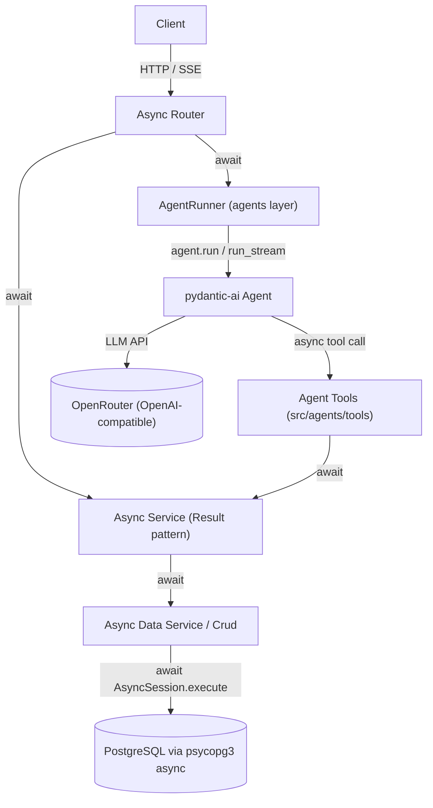

# Agent Harness Boilerplate v0 (with full async rewrite)

## Goal

Two changes in one coordinated pass:

1. **Migrate the whole stack to async** — SQLAlchemy, data services, services, routers, DI, and tests — so the application is natively async top to bottom.
2. **Add a minimal stateless Agent Harness** on top using pydantic-ai connected to OpenRouter, with one sample agent, an agent-tools layer that calls the existing services, and async + SSE streaming endpoints.

Alembic stays sync (its own sync engine).

## Target architecture



Architectural invariant preserved: **only the service layer writes to the DB**, and each HTTP request gets exactly one `AsyncSession` with one transaction, whether it was triggered by a plain CRUD route or an agent run (including from tool calls).

## Part A — Async migration of existing layers

### A1. Dependencies

- `psycopg[binary,pool]>=3.2.0` already present — psycopg v3 supports both sync and async through the same `postgresql+psycopg://` URL, so no driver change is needed.
- Add `pydantic-ai-slim[openai]>=0.0.x` (for Part B).
- `pytest-asyncio>=0.24.0` already in the `test` group. Enable `asyncio_mode = "auto"` under `[tool.pytest.ini_options]` in [pyproject.toml](pyproject.toml) so `async def` tests don't need per-test marks.

### A2. Engine and session

Rewrite [src/database/db_engine.py](src/database/db_engine.py):

```python
from sqlalchemy.ext.asyncio import AsyncSession, async_sessionmaker, create_async_engine
from src.config.config import config

async_engine = create_async_engine(
    config.DATABASE_URL, pool_pre_ping=True, connect_args={"connect_timeout": 10}
)

AsyncSessionMaker = async_sessionmaker(
    bind=async_engine, expire_on_commit=False, autoflush=False, autocommit=False, class_=AsyncSession
)
```

Transaction boundary remains per-request in [src/api_server/deps.py](src/api_server/deps.py):

```python
async def get_db() -> AsyncGenerator[AsyncSession, None]:
    async with AsyncSessionMaker() as session, session.begin():
        yield session
```

Commit on success / rollback on exception behaviour is preserved by `session.begin()` exactly as before.

### A3. Alembic stays sync

No changes to [migrations/env.py](migrations/env.py) signature — `engine_from_config` with the same `postgresql+psycopg://...` URL continues to build a sync engine because it calls `create_engine`, not `create_async_engine`. `make db_migrate` / `make db_upgrade` workflows are unaffected.

### A4. CRUD rewrite

Rewrite [src/data_services/crud.py](src/data_services/crud.py) to use `AsyncSession`. Every statement-executing method becomes `async`:

- `session: AsyncSession` instead of `Session`
- `await self.session.execute(stmt)` / `await self.session.scalars(stmt)` / `await self.session.scalar(...)`
- `await self.session.flush()`
- `entity_exists`, `condition_exists`, `_get_one`, `get_by_id`, `get_by_page`, `_create`, `create`, `_update`, `update`, `delete`, `condition_delete` → all `async def`
- `_apply_params` stays sync (pure statement builder)
- `filters.py` stays unchanged (statement builders are engine-agnostic)

Sketch (create and get_by_page shown, others follow the same pattern):

```python
async def get_by_id(self, entity_id: UUID, with_for_update: bool = False) -> Entity | None:
    try:
        stmt = select(self.entity_type).where(self.entity_type.id == entity_id)
        if with_for_update:
            stmt = stmt.with_for_update()
        result = await self.session.scalars(stmt)
        return result.unique().first()
    except Exception as e:
        ...

async def get_by_page(self, ...) -> tuple[list[Entity], int]:
    stmt = select(self.entity_type)
    count_stmt = select(func.count()).select_from(self.entity_type)
    stmt, count_stmt = self._apply_params(stmt, count_stmt, ...)
    items = (await self.session.scalars(stmt)).unique().all()
    total = (await self.session.scalar(count_stmt)) or 0
    return list(items), total

async def _create(self, create_model, mapper, user_id) -> Entity:
    new_entity = mapper(model=create_model, user_id=user_id)
    self.session.add(new_entity)
    await self.session.flush()
    return new_entity
```

Update [src/data_services/user_data_service.py](src/data_services/user_data_service.py) to accept `AsyncSession` in `__init__`.

### A5. Service layer rewrite

Rewrite [src/services/base_service.py](src/services/base_service.py): every public method (`get_page`, `get_by_id`, `create`, `update`, `delete`, `entity_exists`) becomes `async def` and `await`s the data service.

Rewrite [src/services/user_service.py](src/services/user_service.py): `async def get_page(...)` awaits `super().get_page(...)`.

`Result` / `Ok` / `Err` handling is unchanged — return types stay `Result[Model, ErrorResult]`.

### A6. Router rewrite

Convert every endpoint in [src/api_server/routers/user.py](src/api_server/routers/user.py) to `async def` and `await` the service call. `http_exception_from_error` and `response_409` etc. stay the same.

Example:

```python
@router.get("/{user_id}", response_model=User)
async def get_user_by_id(user_id: UUID, user_service: UserService = Depends(get_user_service)) -> User:
    match await user_service.get_by_id(user_id):
        case Ok(result): return result
        case Err(error): raise http_exception_from_error(error)
        case _:          raise http_exception_from_error()
```

No changes to the FastAPI `app` factory, CORS, correlation-id middleware, or exception handlers (handlers in [src/api_server/main.py](src/api_server/main.py) are already `async def`).

### A7. Tests migration

- Turn on `asyncio_mode = "auto"` so all tests with `async def` run under pytest-asyncio with no decorators.
- Update [src/tests/conftest.py](src/tests/conftest.py):
  - Replace `session` fixture with `AsyncMock(spec=AsyncSession)`.
  - `user_data_service` / `user_service` fixtures construct real classes around the async-mocked session.
  - Add an `async_client` fixture using `httpx.AsyncClient(transport=ASGITransport(app=app), base_url=...)` for router tests.
  - Keep `client: TestClient` too — `TestClient` transparently runs async endpoints, so simple smoke tests don't have to be rewritten.
- Existing unit tests under `src/tests/unit/{routers,services,data_services}` become `async def` and `await` the system-under-test; mocks move from `MagicMock` to `AsyncMock` for awaited calls.
- Fixtures in [src/tests/fixtures/](src/tests/fixtures/) stay synchronous (pure data factories).

## Part B — Agent Harness on top of async stack

### B1. Configuration

Extend [src/config/config.py](src/config/config.py):

```python
OPENROUTER_API_KEY: SecretStr = SecretStr("")
OPENROUTER_BASE_URL: str = "https://openrouter.ai/api/v1"
LLM_DEFAULT_MODEL: str = "openai/gpt-4o-mini"
LLM_REQUEST_TIMEOUT_S: float = 60.0
LLM_HTTP_REFERER: str | None = None   # optional OpenRouter attribution
LLM_APP_TITLE: str | None = None      # optional OpenRouter attribution
```

Document placeholders in [docker-compose.yml](docker-compose.yml) next to DB credentials, with the same TODO on production secret management.

### B2. New layer layout

```
src/
  agents/                   # NEW — above services
    __init__.py
    deps.py                 # AgentDeps dataclass carrying per-request services
    model_factory.py        # build_openrouter_model() -> OpenAIModel
    registry.py             # name -> Agent lookup
    runner.py               # async AgentRunner.run() / run_stream()
    tools/
      __init__.py
      user_tools.py         # tools that await UserService
    sample/
      __init__.py
      agent.py              # Agent[AgentDeps, str] + @agent.tool registrations
      prompts.py            # SYSTEM_PROMPT
  models/
    agent.py                # AgentRunRequest, AgentRunResponse, AgentMessage, StreamEvent
  api_server/routers/agent.py   # NEW async router
  constants/__init__.py         # + AGENTS_PREFIX = "agents"
```

### B3. Bridge from tools to services

[src/agents/deps.py](src/agents/deps.py):

```python
from dataclasses import dataclass
from src.services.user_service import UserService

@dataclass
class AgentDeps:
    user_id: str                 # for audit / future authz
    user_service: UserService
    # add more services here as the harness grows
```

[src/agents/model_factory.py](src/agents/model_factory.py):

```python
from pydantic_ai.models.openai import OpenAIModel
from pydantic_ai.providers.openai import OpenAIProvider
from src.config.config import config

def build_openrouter_model(model_name: str | None = None) -> OpenAIModel:
    provider = OpenAIProvider(
        base_url=config.OPENROUTER_BASE_URL,
        api_key=config.OPENROUTER_API_KEY.get_secret_value(),
    )
    return OpenAIModel(model_name or config.LLM_DEFAULT_MODEL, provider=provider)
```

### B4. Sample agent + async tool

[src/agents/sample/agent.py](src/agents/sample/agent.py):

```python
from pydantic_ai import Agent, RunContext
from result import Ok, Err
from src.agents.deps import AgentDeps
from src.agents.model_factory import build_openrouter_model
from src.agents.sample.prompts import SYSTEM_PROMPT

sample_agent = Agent[AgentDeps, str](
    model=build_openrouter_model(),
    deps_type=AgentDeps,
    output_type=str,
    system_prompt=SYSTEM_PROMPT,
)

@sample_agent.tool
async def count_active_users(ctx: RunContext[AgentDeps]) -> int:
    """Return the number of active users in the system."""
    match await ctx.deps.user_service.get_page(
        page_number=1, page_size=1, omit_pagination=False, is_active=True
    ):
        case Ok(page): return page.total
        case Err(err): raise RuntimeError(err.details)
```

Tools are `async def` and `await` services directly — no threadpool bridge, tools share the request's `AsyncSession`/transaction.

### B5. Registry and runner

- [src/agents/registry.py](src/agents/registry.py): `dict[str, Agent[AgentDeps, Any]]` with `get_agent(name)` raising a typed `AgentNotFoundError`. Adding an agent = one import + one entry.
- [src/agents/runner.py](src/agents/runner.py):
  - `async def run(agent_name, prompt, deps, message_history, usage_limits=None) -> Result[AgentRunResponse, ErrorResult]` — wraps `agent.run(...)`, maps provider/timeout/auth errors to `ErrorStatus`. Accepts an optional `UsageLimits` so token budgets work the moment multi-agent delegation is added (see §C).
  - `async def run_stream(...) -> AsyncIterator[StreamEvent]` — wraps `agent.run_stream(...)`, yields `delta` / `tool_call` / `tool_result` / `final` / `error` events.

### B6. API surface

[src/api_server/routers/agent.py](src/api_server/routers/agent.py) mounted under `/v1/agents`:

- `POST /v1/agents/{agent_name}/run` — async; returns `AgentRunResponse { output, messages, usage }`.
- `POST /v1/agents/{agent_name}/stream` — async; `StreamingResponse(media_type="text/event-stream")`; async generator converts `StreamEvent` into SSE lines.

Both `async def`, depend on `get_db()` + `get_user_service()` + a new `get_agent_deps()` / `get_agent_runner()` in [src/api_server/deps.py](src/api_server/deps.py). `current_user_id: str = "system"` placeholder is kept (auth integration point).

Request model [src/models/agent.py](src/models/agent.py):

```python
class AgentRunRequest(BaseModelWithConfig):
    prompt: str
    message_history: list[AgentMessage] | None = None   # client-managed; stateless server
    model: str | None = None                             # optional override
```

### B7. Integration with existing conventions

- Non-streaming endpoint returns `Result[..., ErrorResult]`; router uses existing `http_exception_from_error`. Streaming endpoint yields an `error` SSE event instead of raising (per SSE conventions).
- All new request/response models extend `BaseModelWithConfig` → camelCase JSON.
- New `AGENTS_PREFIX = "agents"` in [src/constants/__init__.py](src/constants/__init__.py); router registered in [src/api_server/main.py](src/api_server/main.py) under `VERSION_PREFIX`.

## Part C — Multi-agent support (documented; no additional agents shipped in v0)

The architecture is multi-agent ready; v0 ships only one sample agent by choice, but the layers are shaped so the three pydantic-ai multi-agent patterns work without refactoring.

### Patterns supported

1. **Agent-as-tool (LLM-driven delegation).** A parent agent registers a child agent as a `@parent.tool` and calls `await child.run(prompt, deps=ctx.deps, usage=ctx.usage)`. The LLM decides when to delegate. Child runs share the parent's deps (so the same `AsyncSession`/transaction and the same services) and contribute to aggregated token usage.
2. **Programmatic hand-off.** `AgentRunner` orchestrates multiple agents in Python based on typed outputs (e.g. a router agent emits an intent, the runner dispatches to a specialist). Deterministic routing, no LLM required for the dispatch step.
3. **Graph workflow.** For stateful multi-step flows, `pydantic-graph` models agents as nodes with typed edges and persisted state. Escape hatch for later; no code needed in v0.

### What the planned layers give you for free

- **Registry** ([src/agents/registry.py](src/agents/registry.py)) is already a `dict[str, Agent[AgentDeps, Any]]`. Adding agents = one import + one entry; they are immediately reachable at `/v1/agents/{name}/run|stream`.
- **`AgentDeps` is the shared per-request context.** All agents in a run (parent + children) accept the same `AgentDeps`, which means they share the single request-scoped `AsyncSession` and transaction. This is a direct payoff of the async rewrite: a parent agent's tool can await a child agent, whose tools can await services, all inside one DB transaction.
- **`AgentRunner.run()` accepts `UsageLimits`** and will thread `usage` through nested `agent.run(..., usage=...)` calls when delegation is added, so token accounting aggregates across parent and children.
- **Tools are reusable across agents.** `src/agents/tools/` is designed to be consumed by any agent; specialist agents compose the tools they need without duplication.

### Adding a second agent later (illustrative; out of scope for v0)

```
src/agents/
  tools/ ...
  sample/agent.py           # shipped in v0
  specialists/
    summarizer_agent/agent.py   # new
    sql_agent/agent.py          # new
  router_agent/agent.py         # new; registers the two above as @tool
```

Concretely, a router agent delegates like this:

```python
@router_agent.tool
async def ask_summarizer(ctx: RunContext[AgentDeps], text: str) -> str:
    result = await summarizer_agent.run(text, deps=ctx.deps, usage=ctx.usage)
    return result.output
```

`deps=ctx.deps` is what preserves the shared transaction and shared services; `usage=ctx.usage` is what aggregates tokens. No changes to the router, runner, or data/services layers are required to add this.

### Non-goals for v0 (multi-agent specifically)

- No router/specialist agents shipped — keep v0 surface small.
- No `pydantic-graph` dependency or workflow runtime yet.
- No cross-request shared state between agent runs (still stateless; add conversation persistence + a "session" construct in a later milestone if needed for long-running multi-agent collaborations).

## Testing strategy

Only the async migration gets test work in v0; the agent harness ships without new unit tests by design.

- **Mandatory — Part A async migration regression coverage.** All existing unit tests under `src/tests/unit/{routers,services,data_services}/` are migrated in place to run under `pytest-asyncio` (`asyncio_mode = "auto"`). Fixtures in [src/tests/conftest.py](src/tests/conftest.py) swap `Session` mocks for `AsyncMock(spec=AsyncSession)`, and awaited collaborators become `AsyncMock`. This is the safety net that guards the async rewrite; without it the suite goes red.
- **Deferred — Part B agent harness tests.** No new test files for the agent router, `AgentRunner`, registry, tools, or the sample agent in v0. Rationale: the stateless v0 has one sample agent and no real tool orchestration yet; the valuable tests (router HTTP contract, tool `Result`-unwrap, `TestModel` smoke) are cheap to add once real agents or tools exist. When that time comes, add:
  - A router test with a mocked `AgentRunner` (404 on unknown agent, SSE content-type, error mapping).
  - A tool test that builds a `RunContext` with an `AsyncMock`-backed `UserService` and asserts the `Ok`/`Err` unwrap.
  - A `TestModel`/`FunctionModel`-based agent test for any agent with non-trivial tool routing.

## Explicit non-goals

- No DB persistence for conversations / messages / agent runs (stateless first — deferred to a follow-up phase).
- No authentication wiring (keeps the `"system"` placeholder).
- No multi-model router, no cost tracking, no Logfire/OTel yet.
- No file-search / RAG tools — `src/agents/tools/` is the designated home; first concrete one is out of scope for v0.

## Open items for a later phase

- Conversation / Message / AgentRun entities (new migration) once UX needs server-side history.
- Logfire or OTel instrumentation for agent runs.
- Request-level model override policy once real usage exists.
- Auth integration replacing the `"system"` placeholder.
