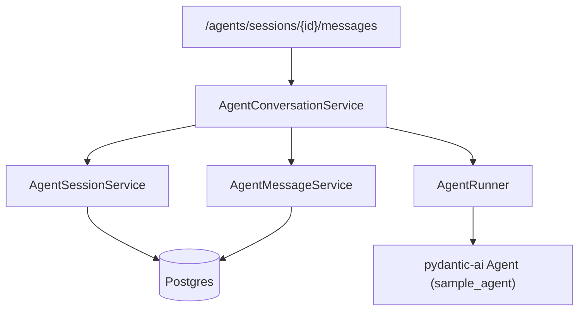

## Summary of decisions (already confirmed)

- **Storage**: Postgres via existing `Entity → DataService → Service` layering.
- **API shape**: full REST — `POST /sessions`, `POST /sessions/{id}/messages`, `GET /sessions`, `GET /sessions/{id}`, `DELETE /sessions/{id}`.
- **Streaming**: dropped for now; single JSON endpoint per action.
- **Single agent**: the sole `sample_agent` is the server-side default; clients cannot pick agent name or model.
- **Usage stats**: not returned to clients. Token counts are still recorded server-side on `AgentMessageEntity` for ops/observability, but never exposed in API responses.

## Current state (what we're replacing)

- [src/api_server/routers/agent.py](src/api_server/routers/agent.py) exposes `POST /agents/{agent_name}/run` and `/stream`, both accepting `message_history` and `model` in the body — this is the stateless surface being removed.
- [src/agents/registry.py](src/agents/registry.py) keeps a `dict` of agents keyed by name — collapses to a single `get_default_agent()`.
- [src/agents/runner.py](src/agents/runner.py) already has `_agent_messages_to_model_messages` / `_model_messages_to_agent_messages` — we reuse both, extended to round-trip tool parts from persisted rows.
- [src/models/agent.py](src/models/agent.py) holds stream event helpers (`delta_event`, `tool_call_event`, etc.) — we strip the streaming surface.

## Data model

Two new entities, both extending `Base` + `BaseAuditEntity` (same pattern as [src/database/entities/user.py](src/database/entities/user.py)):

- `AgentSessionEntity` — `id: UUID`, `owner_user_id: str` (indexed), `title: str | None`. The session is logically owned by the caller; soft-deletion via `is_active` from the audit base.
- `AgentMessageEntity` — `id: UUID`, `session_id: UUID` (FK → `agent_session.id`, indexed), `sequence: int` (monotonic per session, `UniqueConstraint(session_id, sequence)`), `role: str`, `content: str`, `tool_name: str | None`, `tool_payload: JSONB | None` (args for tool calls, result for tool returns — discriminated by `role`), `input_tokens: int | None`, `output_tokens: int | None`.

Rationale: one normalized row per logical turn keeps listing/rendering fast and queryable; the `tool_payload` JSONB gives full-fidelity replay of tool traces (fixing the current lossy round-trip noted in [src/agents/runner.py L145](src/agents/runner.py)). Migration generated via `make db_migrate message="add_agent_sessions_and_messages"`.

## Layered wiring

The orchestration service is the new piece. Everything below it follows the existing layering rule from `CLAUDE.md`.

## Files to add

- `src/database/entities/agent_session.py`, `agent_message.py` — entities above, registered in `src/database/entities/__init__.py`.
- `src/models/agent_session.py` — `AgentSession`, `AgentSessionCreate`, `AgentSessionUpdate`, `AgentSessionWithMessages` (Pydantic).
- Update `src/models/agent.py` — keep `AgentRole` / `AgentMessage`, add:
  - `AgentMessageCreate` (internal write model, has `session_id`, `sequence`, `role`, `content`, optional tool fields, and optional `input_tokens` / `output_tokens` for server-side persistence only).
  - `AgentPromptRequest` — the only public request body: `{ prompt: str }`.
  - `AgentTurnResponse` — `{ output: str, newMessages: list[AgentMessage] }`. Usage is intentionally omitted from the public surface.
  - Delete `StreamEvent`, `StreamEventType`, `delta_event`, `tool_call_event`, `tool_result_event`, `final_event`, `error_event`, and the `model` / `message_history` fields on the old `AgentRunRequest`.
  - Remove `AgentUsage` from the exported public models. If still needed internally (logging, runner return type) keep it as a private dataclass inside `src/agents/runner.py`; otherwise drop it entirely.
- `src/mappers/agent_session.py`, `src/mappers/agent_message.py` — `to_agent_session_entity`, `to_agent_message_entity`.
- `src/data_services/agent_session_data_service.py`, `agent_message_data_service.py` — each a thin `Crud[...]` subclass, mirroring [src/data_services/user_data_service.py](src/data_services/user_data_service.py). `AgentMessageDataService` also adds a `list_by_session(session_id, ...) -> list[AgentMessageEntity]` helper returning rows ordered by `sequence`.
- `src/services/agent_session_service.py` — `BaseService[AgentSessionEntity, AgentSession, AgentSessionCreate, AgentSessionUpdate]`, plus `get_by_id_for_user(session_id, user_id)` that returns `NOT_FOUND` when `owner_user_id` mismatches (prep for real auth; today everything is `"system"`).
- `src/services/agent_message_service.py` — same pattern, exposes `list_for_session(session_id)` and `append(create_model)`.
- `src/services/agent_conversation_service.py` — the composition point. Single entry point `send_message(session_id: UUID, prompt: str, user_id: str, agent_deps: AgentDeps) -> Result[AgentTurnResponse, ErrorResult]`:
  1. Load session via `AgentSessionService.get_by_id_for_user`.
  2. Load message rows via `AgentMessageService.list_for_session`, reconstruct `list[ModelMessage]` using an expanded version of `_agent_messages_to_model_messages` (new one reads `tool_name`/`tool_payload` JSONB to rebuild `ToolCallPart` / `ToolReturnPart` so replay is lossless).
  3. Call `AgentRunner.run(...)` with `get_default_agent()` and that history.
  4. Persist the new user prompt row, then rows for each entry in `result.new_messages()`, assigning `sequence = last_sequence + i`.
  5. Return `AgentTurnResponse` containing the just-persisted rows mapped to `AgentMessage`.

## Files to modify

- [src/agents/registry.py](src/agents/registry.py) — replace `_REGISTRY` and `get_agent(name)` with `get_default_agent() -> Agent[AgentDeps, Any]` returning `sample_agent`. Remove `list_agents`. Delete `AgentNotFoundError` usages from `src/utils/exceptions.py`.
- [src/agents/runner.py](src/agents/runner.py) — remove `agent_name`, `model`, streaming, and the flatten-to-wire helper's tool-trace lossiness:
  - `AgentRunner.run` signature becomes `run(prompt, history: list[ModelMessage], deps) -> Result[RunnerOutput, ErrorResult]` where `RunnerOutput` is a small internal dataclass `{output, new_messages: list[ModelMessage], usage: RunUsage}`. `usage` stays inside the runner/conversation layer so token counts can be written onto `AgentMessageEntity` rows, but it never reaches the router.
  - Delete `run_stream`, `_emit_new_tool_events`, `_coerce_tool_args`, `_coerce_json`.
  - Keep `_map_pai_error`.
- [src/api_server/routers/agent.py](src/api_server/routers/agent.py) — rewrite completely:
  - `POST /agents/sessions` → `AgentSession`
  - `GET /agents/sessions` → paginated `ModelList[AgentSession]` (reuse pagination pattern from [src/api_server/routers/user.py](src/api_server/routers/user.py))
  - `GET /agents/sessions/{session_id}` → `AgentSessionWithMessages`
  - `DELETE /agents/sessions/{session_id}` → 204 (soft delete via existing `BaseService.delete`, or we flip `is_active=False` if hard delete isn't desired — will match the behaviour of `DELETE /v1/users/{id}`).
  - `POST /agents/sessions/{session_id}/messages` body `AgentPromptRequest` → `AgentTurnResponse`.
- [src/api_server/deps.py](src/api_server/deps.py) — add `get_agent_session_data_service`, `get_agent_session_service`, `get_agent_message_data_service`, `get_agent_message_service`, `get_agent_conversation_service`. Drop `get_agent_runner` from the public surface (the runner becomes an implementation detail of the conversation service).
- [src/api_server/main.py](src/api_server/main.py) — no change (router already registered).
- [src/constants/__init__.py](src/constants/__init__.py) — add `AGENT_SESSIONS_PREFIX = "sessions"` if you want nested path constants; otherwise the router composes it inline.

## Tests

- Add unit tests alongside the existing ones:
  - `src/tests/unit/data_services/test_agent_session_data_service.py`, `test_agent_message_data_service.py` (mirrors `test_crud.py` fixtures).
  - `src/tests/unit/services/test_agent_session_service.py`, `test_agent_message_service.py`, `test_agent_conversation_service.py`. The conversation-service tests mock `AgentRunner`, assert sequence numbers are contiguous, tool payloads round-trip, and that `owner_user_id` mismatch → `NOT_FOUND`.
  - `src/tests/unit/routers/test_agent.py` covering the new REST surface (`201` on session create, `404` on foreign session, `200` on message turn, `204` on delete).
- Delete/rewrite any tests referencing `/{agent_name}/run` or streaming.
- Follow the `.agents/skills/add-entity-tests/SKILL.md` conventions if the user invokes the entity-test skill.

## Migration & ops

- Run `make db_migrate message="add_agent_sessions_and_messages"` to generate the Alembic revision, then `make db_upgrade`. Confirm the revision uses `config.DATABASE_SCHEMA`.
- Pre-commit (`make pre_commit`) and `make test` must both pass.

## Caveats to flag while implementing

- `get_current_user_id()` in [src/api_server/deps.py L26](src/api_server/deps.py) still returns `"system"`; the `owner_user_id` enforcement in `AgentSessionService` is correct but effectively a no-op until real auth ships. The ground is prepped so turning on auth later is a no-code-change event for this module.
- Long sessions will grow the message list every turn. A `max_history_messages` safety cap (e.g. last N = 50 entries + the most recent system prompt) in the conversation service is cheap to add now and hard to retrofit; recommended as part of this change.
- Transaction scope: persisting the user prompt, running the agent, and persisting new assistant/tool rows all happen inside the same `get_db()` transaction. If the LLM call fails mid-turn the user-prompt row rolls back — desirable behaviour but worth confirming you're happy with it (alternative is committing the user turn first in its own transaction, which requires bypassing the current `get_db()` helper).